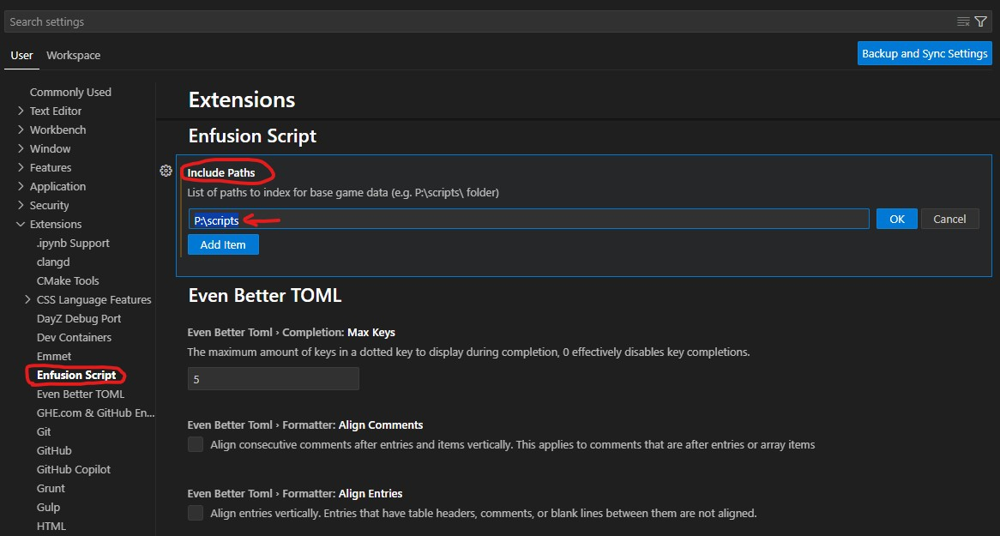
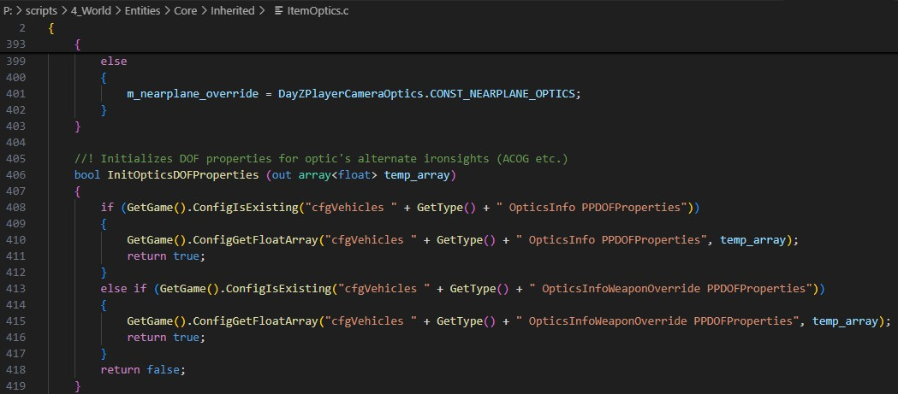
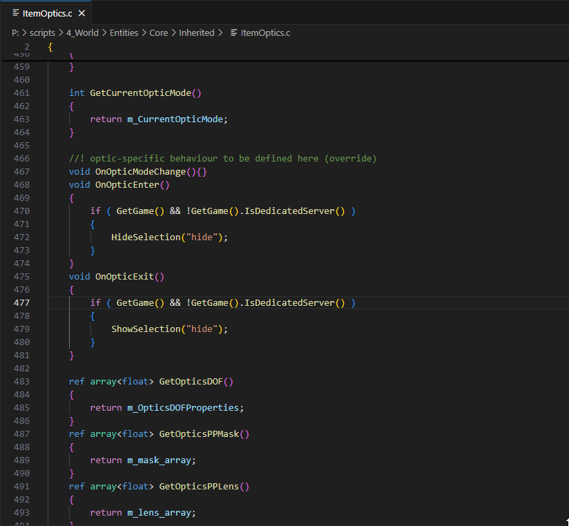
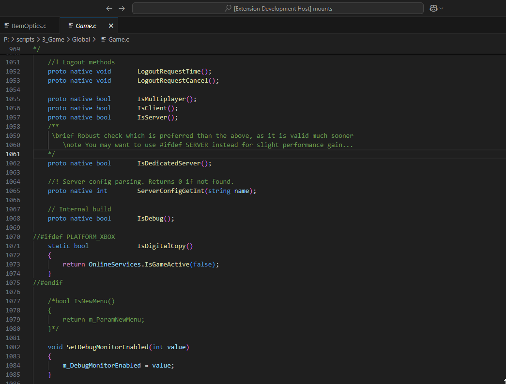

# Enfusion Script

Enfusion Script is an unofficial VSCode extension for DayZ modders that indexes enfusion-script and allows advanced IDE features such as syntax highlighting, jump to definition, etc.

## 🔧 Initial setup

The extension works out of the box for the opened project, but additional setup is required to also index the vanilla enscript codebase.

Find your extracted scripts folder (usually `P:\scripts`) and add it to user settings:

**Important:** Reload the window after saving!

## 🧩 Extension

1. **Syntax Highlighting:** Syntax highlighting for EnScript language!

2. **Hover & Jump to Definition:** Indexed symbols have their own hover and may be Ctrl+Click'ed to jump to definition.

3. **Workspace Symbols**: Supports convenient symbol definition search.

